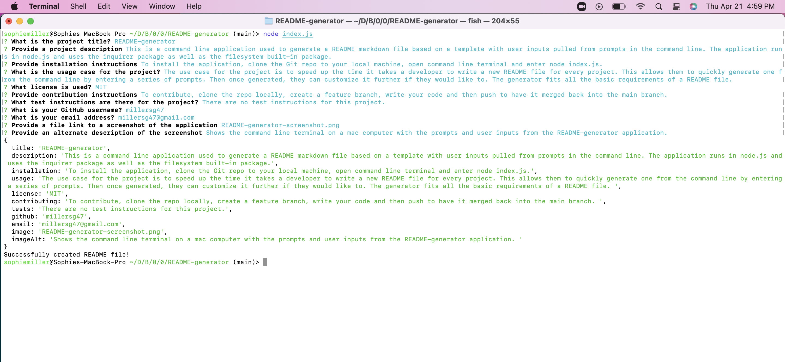

  
  # README-generator

  

  ## Tabel of Countents
  - [Description](#description)
  - [Installation](#installation)
  - [Usage](#usage)
  - [Contributing](#contributing) 
  - [Tests](#tests)
  - [License](#license)
  - [Questions](#questions)
  
  
  ## Description
  This is a command line application used to generate a README markdown file based on a template with user inputs pulled from prompts in the command line. The application runs in node.js and uses the inquirer package as well as the filesystem built-in package.

  

  
  ## Installation
  To install the application, clone the Git repo to your local machine, open command line terminal and enter node index.js.
  
  ## Usage    
  The use case for the project is to speed up the time it takes a developer to write a new README file for every project. This allows them to quickly generate one from the command line by entering a series of prompts. Then once generated, they can customize it further if they would like to. The generator fits all the basic requirements of a README file. 

  Watch this [walkthrough video](https://youtu.be/coGTBLeYqOM) to see how the application is used.
  
  ## Contributing 
  To contribute, clone the repo locally, create a feature branch, write your code and then push to have it merged back into the main branch. 
  
  ## Tests 
  There are no test instructions for this project.
  
  ## License
    MIT
  
  ## Questions
  - [GitHub profile](github.com/millersg47)
  - Contact Me at millersg47@gmail.com with additional questions
