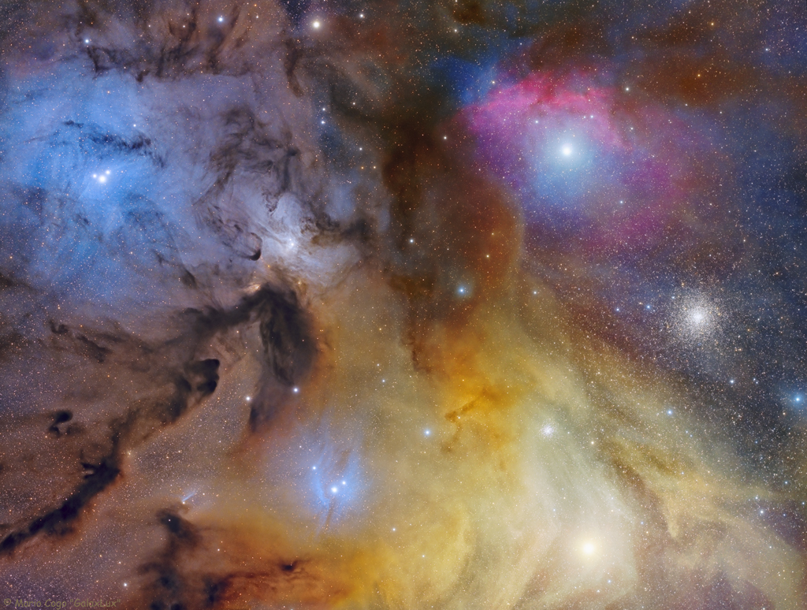

  
  # Sample Project

  

  ## Tabel of Countents
  - [Description](#description)
  - [Installation](#installation)
  - [Usage](#usage)
  - [Contributing](#contributing) 
  - [Tests](#tests)
  - [License](#license)
  - [Questions](#questions)
  
  
  ## Description
  This is a description of the project for this README file.

  
  
  ## Installation
  To install this application, clone the repo to your local machine and run the project. 
  
  ## Usage    
  This is an explanation of the use case for the sample project.
  
  ## Contributing 
  These are contribution instructions.
  
  ## Tests 
  There are no test instructions for this project.
  
  ## License
    Mozilla Public License 2.0
  
  ## Questions
  - [GitHub profile](github.com/millersg47)
  - Contact Me at millersg47@gmail.com with additional questions